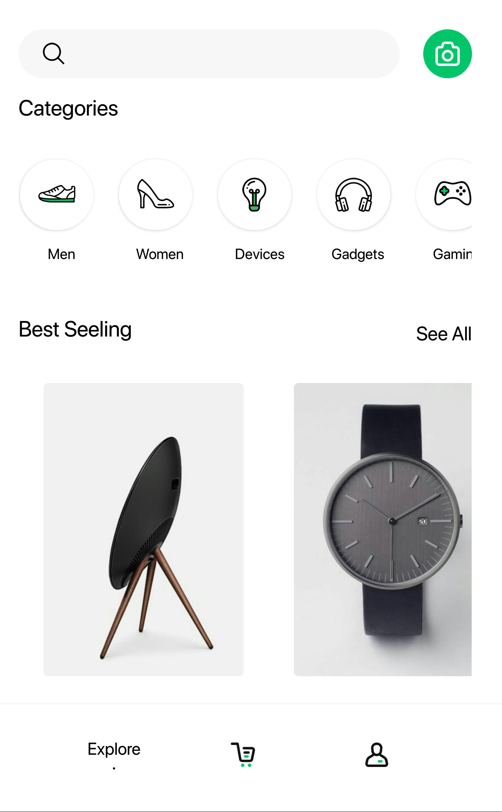
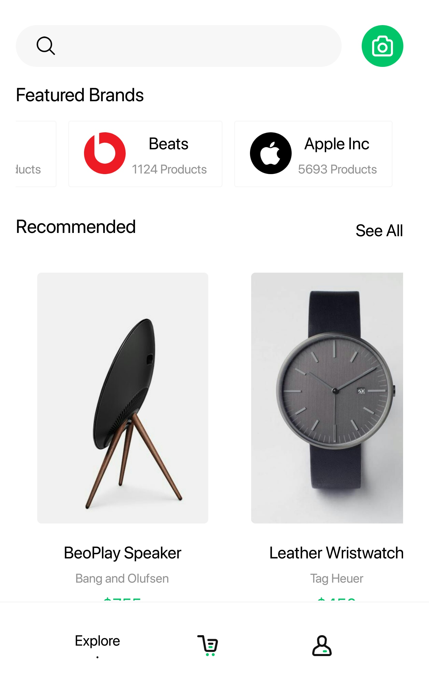
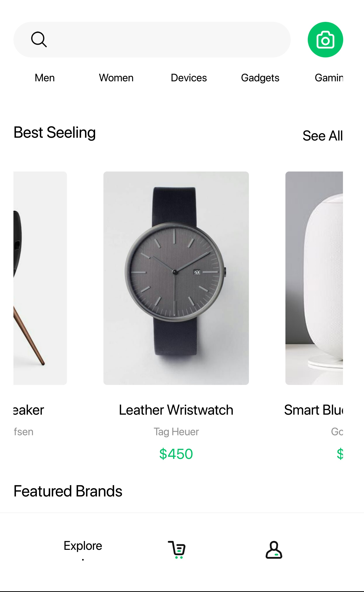
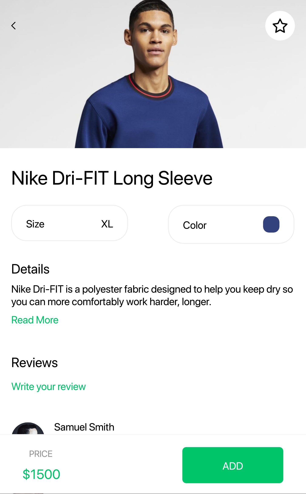
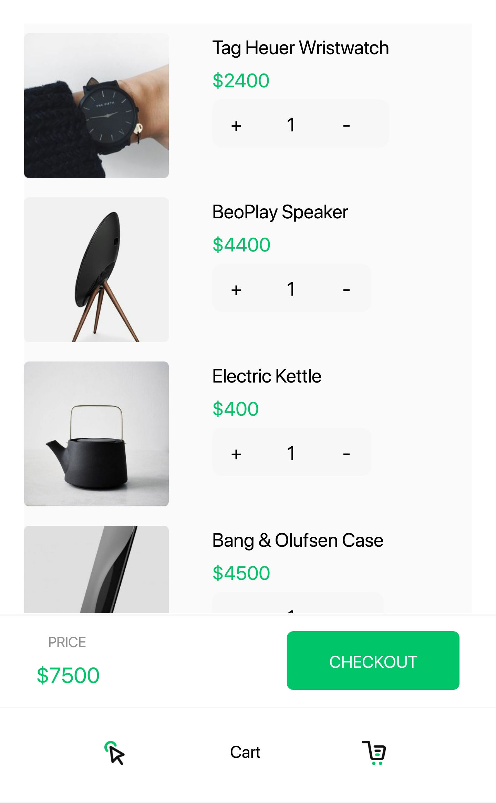
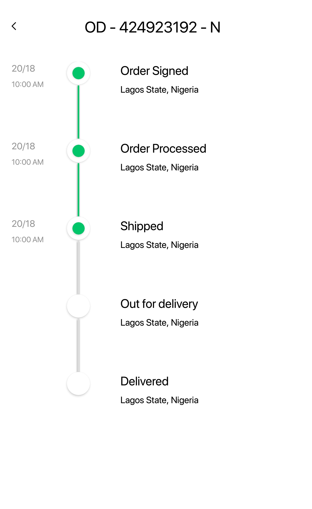
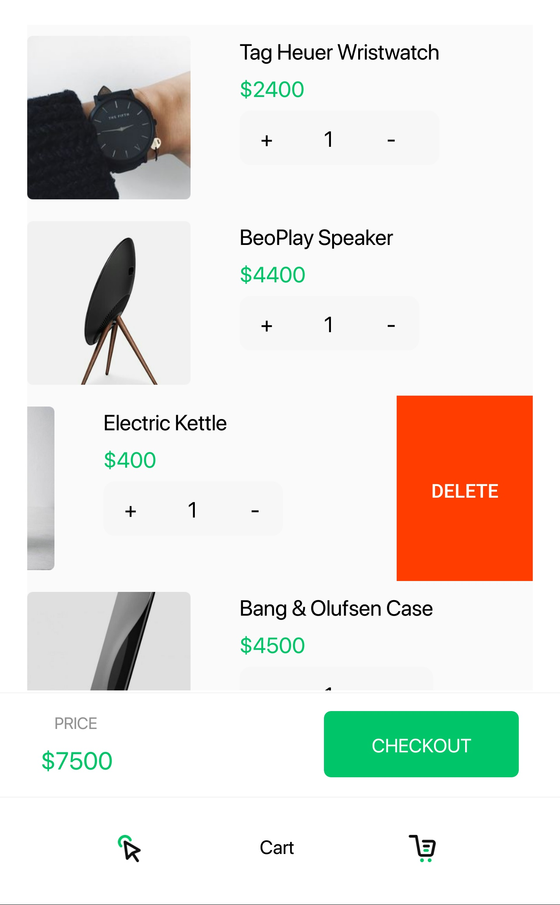
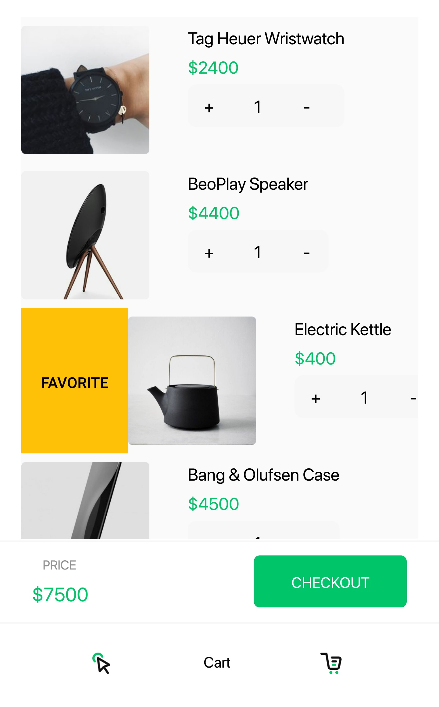

# Ecommerce Design
Ecommerce design with Xamarin Forms

## Developed using 
Xamarin Forms V 4.5.0.617 (Updated to 5.0) 
Learn More: https://docs.microsoft.com/en-us/xamarin/xamarin-forms/

## Features
* ColletionView
* SwipeView
* TabbedPage
* Font Icon

## Generate C# code from icon font
Link: https://andreinitescu.github.io/IconFont2Code/

## Screenshots
 &nbsp;&nbsp;&nbsp; 
 &nbsp;&nbsp;&nbsp; 
  
 &nbsp;&nbsp;&nbsp; 
  &nbsp;&nbsp;&nbsp;
  
 &nbsp;&nbsp;&nbsp; 
&nbsp;&nbsp;&nbsp; 
 
 &nbsp;&nbsp;&nbsp;
 &nbsp;&nbsp;&nbsp;
 

## Preview

## Design Based on
https://www.uistore.design/items/shopping-ui-kit-for-adobe-xd/

## Stats

